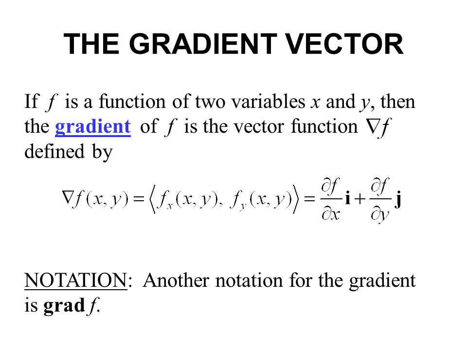
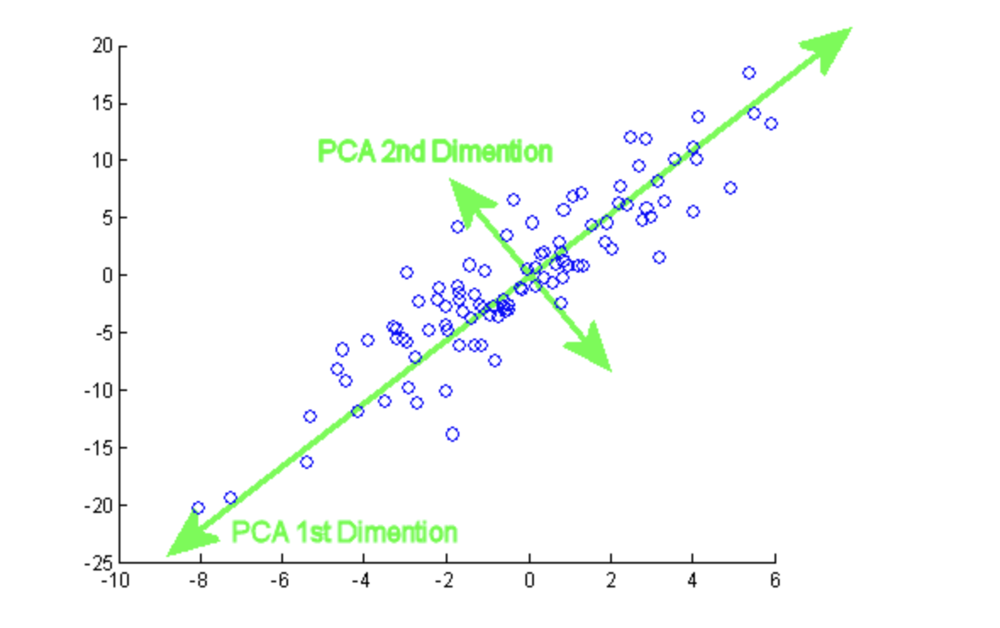

### Sets of Interest in Linear Algebra.   
Z : Set of integers : -1,0,1,2,3,4     
Q : Quotient: Set of rational numbers:  1/2 , 3/4. -5/2.   
R : Set of real numbers :  e, pi, 1, ,2 , 4.5, \sqrt(2).     
C:  Set of complex numbers    

### What is a Vector:   
Physicist: Something which has mangnitude and direction.  
Computer Science:  Ordered list of numbers (a record) (houses as 2-d vector of price and sq.footage).    
Mathematician:   Anything which can be added and scaled according to vector laws.   

In linear algebra: Vectors are always rooted at the origin. Origin is root of all vectors.      
The coordinates are written vertically [ 2/3 ]  to avoid confusing with a point like (2,3) . 

### Gradient as Vectors:    
The gradient of a vector valued function f:R^n to R is the vector of the partial derivatives of f:  

### Vector valued functions:   
Functions of one or more numbers or vectors to an ouput vector.    
think of scalar as one-dimensional vector, so the function can take in a scalar as well.    
example:   
f(a,b) =  (a+b, a-b), so that.  f(-2,1) = (-2+1, -2-1) = (-1,3)

### Span of vectors:   
Set of all possible points you can reach by any pair of vectors is called it's span.   
OR.  
Span is all possible linear combination of basis vectors.   

### linearly dependent vectors:    
Vectors which can be described as linear combinations of other vectors.   

### Eigen Vector 
Vector which when multiplied by the transformation matrix get's scaled by a constant factor.   
That constant factor is called as **Eigen value**.

### How PCA uses eigen vector and values. 
To reduce dimension, instead of original dimensions as axes, eigen vector along the maximum variance is calculated and individual components are projected down to the eigen vector.     
Say, we have a dataset with ‘n’ predictor variables. We center the predictors to their respective means and then get an n x n covariance matrix. This covariance matrix is then decomposed into eigenvalues and eigenvectors.  
Covariance matrix (also called as dispersion matrix or variance-covariance matrix) is a matrix whose element in the i,j position is the covariance between the i-th and j-th element (feature) of a random vector (A random vector is a random variable with multiple dimensions).  
So, PCA is a method that:  
Measures how each variable is associated with one another using a Covariance matrix. 
Understands the directions of the spread of our data using Eigenvectors. 
Brings out the relative importance of these directions using Eigenvalues. 

### What is a Tensor:    
Tensors are multi-indexed arrays of numbers, or functions, that transform according to certain rules under a change of coordinates.    
Tensor Orders:   
0-tensor:  scalar.  
1-tensor:  vector.   
2-tensor:  matrix.  
3-tensor:  a 3d cube of numbers.      

#### Vector Operations:    
1) Addition:   can only be done on vectors with equal dimensions. Is associative as well as commutatitve.      
2) Multiplication by scalar:   They scale the vector.   

#### Linear Combination:    
A linear combination of u and v is a vector au+bv where a and b are scalers.   
All vectors can be represented as linear combination of unit vectors.   

Superposition can be represented by a linear combination of states.   

